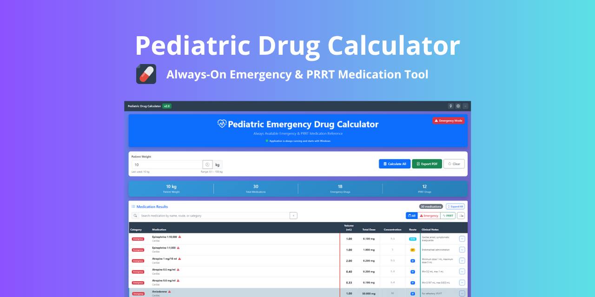

# 🩺 Pediatric Emergency Drug Calculator


> **A professional, always-available pediatric medication calculator for emergency and critical care settings**



---

## 🚨 Why This Tool Exists

In pediatric emergencies, every second counts. This application provides **instant, reliable medication calculations** for healthcare professionals, eliminating manual math errors and saving critical time during resuscitation scenarios.

---

## ✨ Key Features

### 🎯 **Core Functionality**
- **⚡ Instant Calculations** - Real-time dose calculations as you type
- **🏥 Dual Medication Databases** - Emergency drugs + PRRT protocols
- **📊 Professional Visualization** - Interactive charts and analytics
- **🔒 Offline Operation** - No internet required after installation

### 🎨 **Smart Interface**
- **🌙 Dark/Light Themes** - Reduce eye strain during extended use
- **🚨 Emergency Mode** - High-visibility mode for critical situations
- **🔍 Advanced Filtering** - Search by medication, route, or category
- **📱 Responsive Design** - Optimized for various screen sizes

### 💾 **Professional Features**
- **📄 PDF Export** - Generate professional patient reports
- **⚙️ Customizable Settings** - Decimal precision, auto-calculation, and more
- **📈 Data Visualization** - Medication distribution charts
- **🔄 Quick Actions** - One-click common pediatric weights

---

## 🖥️ System Requirements

- **Windows 10/11** (64-bit)
- **100MB** free disk space
- **Screen resolution**: 1024x768 or higher

---

## 📥 Installation & Setup

### Method 1: Direct Download (Recommended)
1. **Download** the latest release from our [Releases Page](https://github.com/yazen4Gamer/pediatric-drug-calculator/releases)
2. **Run** the installer (`PediatricDrugCalculator-Setup-2.0.0.exe`)
3. **Launch** the application from your Start Menu or Desktop

### Method 2: Portable Version
1. Download the portable ZIP from [Releases](https://github.com/yazen4Gamer/pediatric-drug-calculator/releases)
2. Extract to your preferred location
3. Run `Pediatric Drug Calculator.exe`

> **💡 Pro Tip**: Pin the application to your taskbar for quick access during emergencies.

---

## 🚀 Quick Start Guide

### 1. **Basic Calculation**
```plaintext
1. Enter patient weight in kilograms
2. Click "Calculate All" or let auto-calculate work
3. View all medication doses instantly